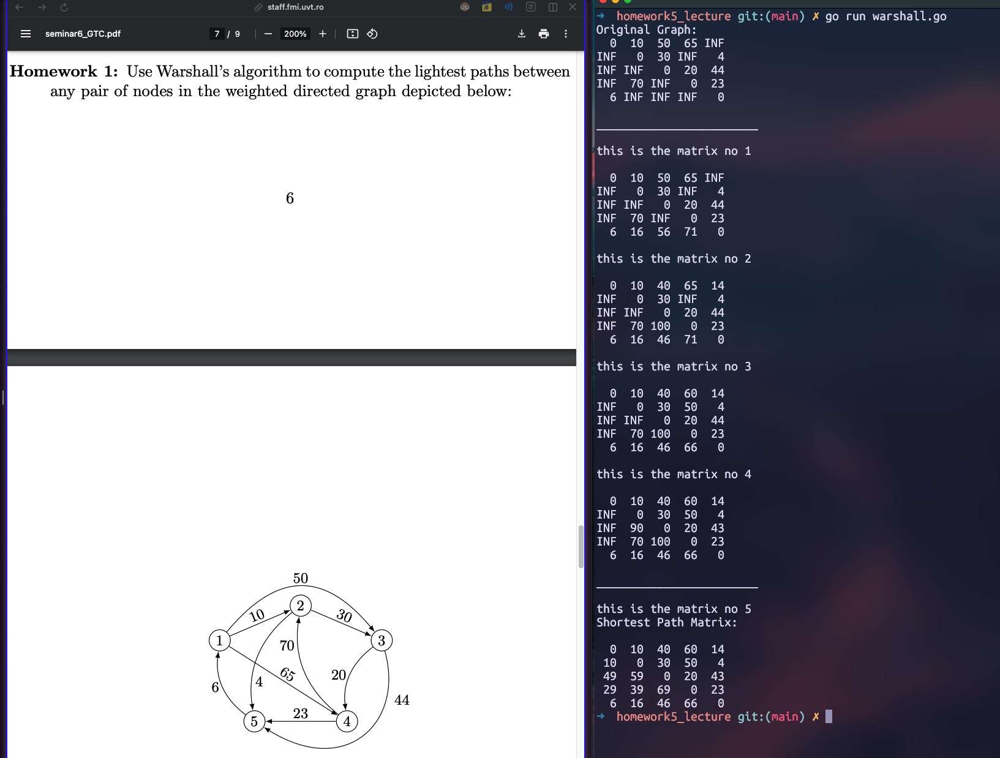

# Homework 5 for seminary 6 GTC.

# Exercises in seminar6_GTC.pdf

## Homework 1 (called): 
- Use Warshall’s algorithm to compute the lightest paths between
any pair of nodes in the weighted directed graph depicted below:

## Homework 2 (work in progress): 
- ...
## Homework 3 (work in progress):  
- ...
